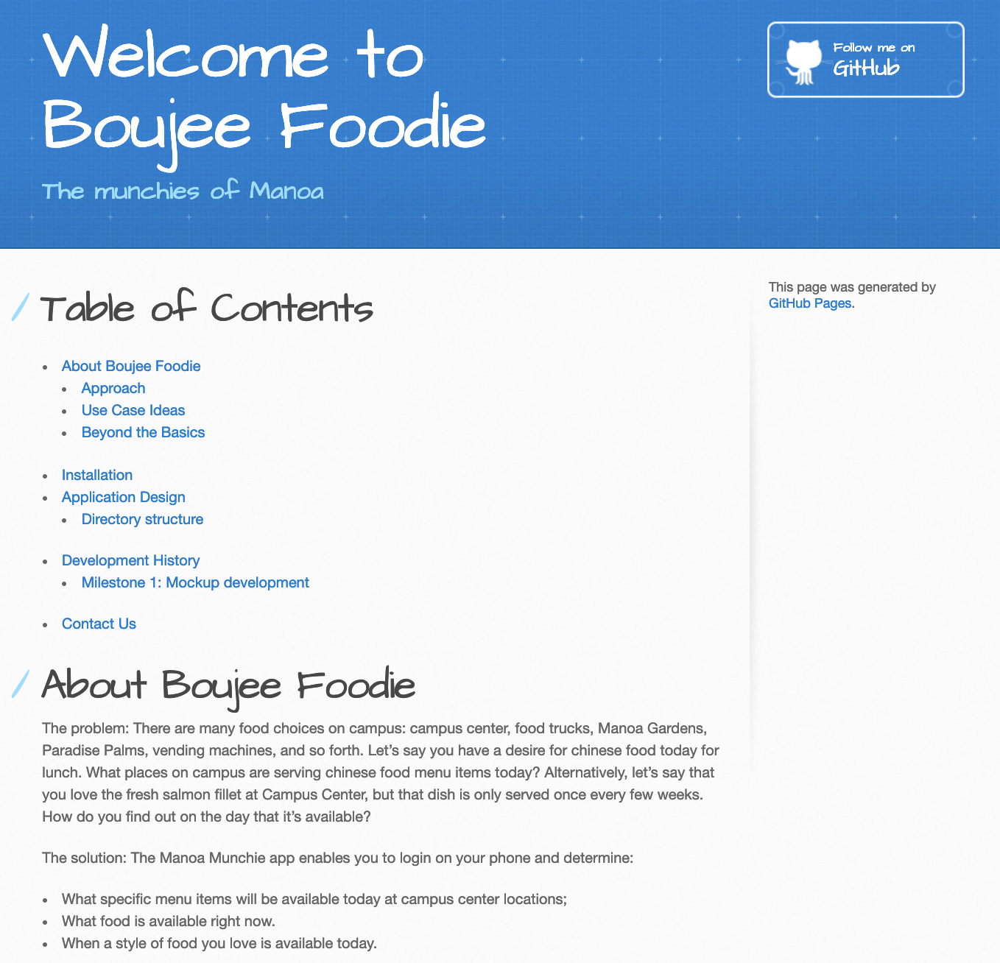

# Table of Contents
* [About Boujee Foodie](#about-boujee-foodie)
  * [Approach](#approach)
  * [Use Case Ideas](#use-case-ideas)
  * [Beyond the Basics](#beyond-the-basics)
* [Installation](#installation)
* [Application Design](#application-design)
  * [Directory structure](#directory-structure)
* [Development History](#development-history)
  * [Milestone 1: Mockup development](#milestone-1-mockup-development)
* [Contact Us](#contact-us)

# About Boujee Foodie
The problem: There are many food choices on campus: campus center, food trucks, Manoa Gardens, Paradise Palms, vending machines, and so forth. Let’s say you have a desire for chinese food today for lunch. What places on campus are serving chinese food menu items today? Alternatively, let’s say that you love the fresh salmon fillet at Campus Center, but that dish is only served once every few weeks. How do you find out on the day that it’s available?

The solution: The Manoa Munchie app enables you to login on your phone and determine:
  * What specific menu items will be available today at campus center locations;
  * What food is available right now.
  * When a style of food you love is available today.

## Approach
For this app, you will create a way to organize and present available menu items for all campus locations in a unified manner. There are three roles: Users, who can login to establish preferences for their food choices; Vendors, who can login to specify their choices of the day or otherwise modify their profile data; and Admins, who also can login to define users as having the vendor role and otherwise administer the system.

Your app should provide a consolidated, easy to use source directory of menu items taken from the UHM Food Vendors and Manoa Dining Services. In addition to organizing menus by vendor, you should also organize the data by menu item type (ethnicity, vegan, etc.).

Users should be able to indicate preferences and/or food types to exclude in their profile, which will help the app to present more useful choices.

For places with weekly or daily changing menus, vendors should be able to login to provide this data.


## Use Case Ideas
Whether or not the following bullet points list all pages or not, the completed use case should show an end-to-end scenario of using the system.

* New user goes to landing page, logs in, gets home page, sets up profile. (How do they learn how system works?)
* Admin goes to landing page, logs in, gets home page, edits site.
* User goes to landing page, logs in, looks for food to buy.
* User is notified of daily menu items that match their preferences

## Beyond the Basics
After implementing the basic functionality, here are ideas for more advanced features:

* Notify students via email, twitter, SMS when particular food choices are available.
* Automated updating of menu items from vendors. For example, they agree to post their daily specials via twitter, and your application retrieves their twitter feed and uses that data to update their page.
* Allow students to rate menu items.
* Integrated map functionality; note that some food trucks change their location over the course of a week.
* Provide feed of tweets from vendors (some vendors might use Twitter to advertise daily specials and locations.)

# Installation

First, [install Meteor](https://www.meteor.com/install).

Second, [download a copy of Boujee Foodie](https://github.com/boujeefoodie/boujeefoodie/archive/master.zip), or clone it using git.
  
Third, cd into the app/ directory and install libraries with:

```
$ meteor npm install
```

Fourth, run the system with:

```
$ meteor npm run start
```

If all goes well, the application will appear at [http://localhost:3000](http://localhost:3000).

# Application Design

## Directory structure

The top-level directory structure contains:

```
app/        # holds the Meteor application sources
config/     # holds configuration files, such as settings.development.json
.gitignore  # don't commit IntelliJ project files, node_modules, and settings.production.json
```

This structure separates configuration files (such as the settings files) in the config/ directory from the actual Meteor application in the app/ directory.

The app/ directory has this top-level structure:

```
client/
  lib/           # holds Semantic UI files.
  head.html      # the <head>
  main.js        # import all the client-side html and js files. 

imports/
  api/           # Define collection processing code (client + server side)
    base/
    interest/
    profile/
  startup/       # Define code to run when system starts up (client-only, server-only)
    client/        
    server/        
  ui/
    components/  # templates that appear inside a page template.
    layouts/     # Layouts contain common elements to all pages (i.e. menubar and footer)
    pages/       # Pages are navigated to by FlowRouter routes.
    stylesheets/ # CSS customizations, if any.

node_modules/    # managed by Meteor

private/
  database/      # holds the JSON file used to initialize the database on startup.

public/          
  images/        # holds static images for landing page and predefined sample users.
  
server/
   main.js       # import all the server-side js files.
```

# Development History

## [Milestone 1](https://github.com/boujeefoodie/boujeefoodie/projects/1): Mockup development
Our first milestone consist of:

* Deployment of Application in [Galaxy](http://boujeefoodie.meteorapp.com/#/)

Many of the milestone goals consist of working on the landing page. 

This was split into different task: Navigation Bar, Middle Page, Footer


Another goal, was to create a page for Users and Admin to sign in.


Once the User/Admin has logged in, it takes them to the Landing Page which has additional tabs in the Navigation bar.


When the User/Admin clicks on the List Restaurant Page, they are presented with this:


After all these milestone goals are done, we documented our progression and updated our [Github.io page](https://boujeefoodie.github.io/).



## [Milestone 2](https://github.com/boujeefoodie/boujeefoodie/projects/2)

# Contact Us

Jetro Butac: jetro@hawaii.edu

Ryan Li: ryanli80@hawaii.edu

Kevin Liu: liukevin@hawaii.edu

Jonathan Tu: jltu@hawaii.edu
