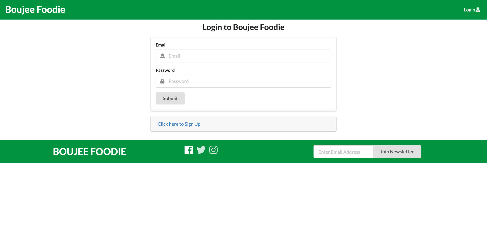
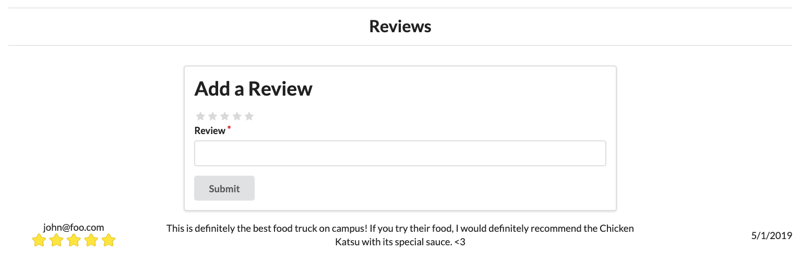
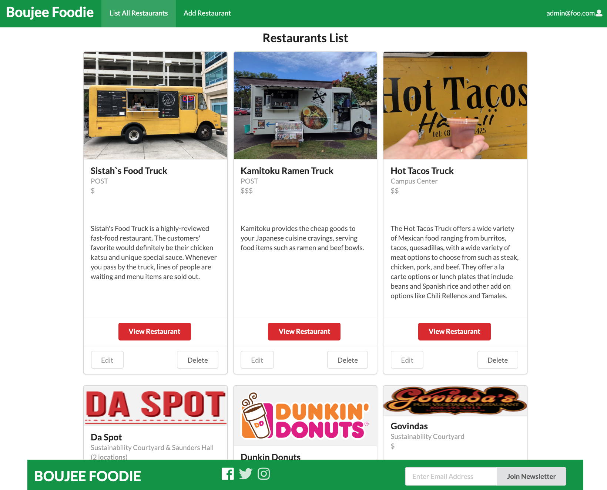
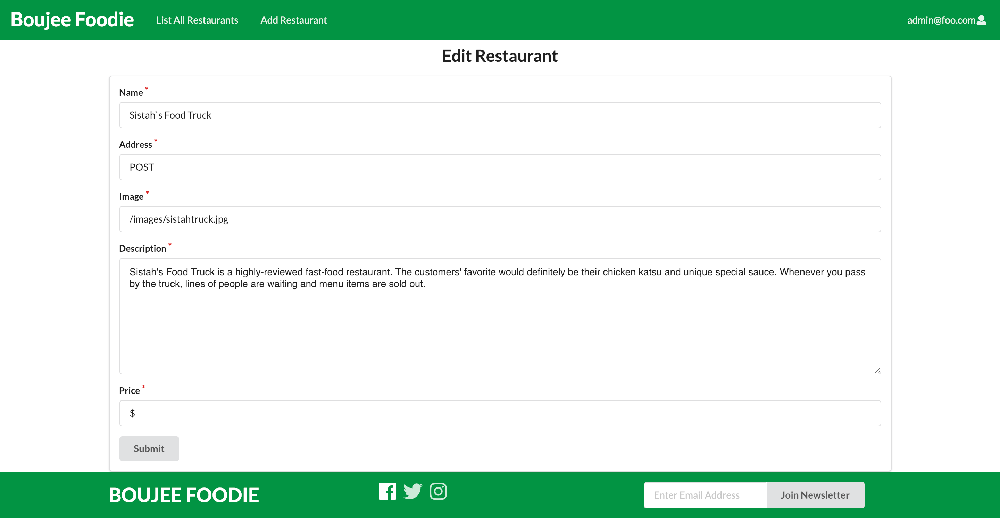
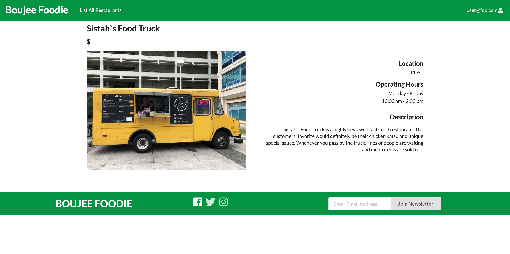

# Table of Contents
* [Boujee Foodie Overview](#boujee-foodie-overview)
* [User Guide](#user-guide)
  * [Regular Users](#regular-users)
  * [Admin Users](#admin-users)
* [Developer Guide](#developer-guide)
  * [Installation](#installation)
* [Application Design](#application-design)
  * [Directory structure](#directory-structure)
* [Development History](#development-history)
  * [Milestone 1: Mockup development](#milestone-1-mockup-development)
  * [Milestone 2: Mockup development](#milestone-2-mockup-development)
  * [Milestone 3: Mockup development](#milestone-3-mockup-development)
* [Contact Us](#contact-us)

# Boujee Foodie Overview
There are many food choices on campus: campus center, food trucks, Manoa Gardens, Paradise Palms, vending machines, and so forth. With Boujee Foodie, all users can find nearby restaurants at UH Manoa in no time! 

Boujee Foodie is a website that allows individuals, particularly students and faculty, to view the available restaurants on the UH Manoa. In addition, it specifies the restaurant information for each vendor available, allows users to check community reviews as well as add their own reviews, and locates the various restaurants on campus.

Boujee Foodie enables you to login and determine:
  * What specific menu items will be available today at campus center locations;
  * What food is available right now.
  * When a style of food you love is available today.

# Links:
Deployed Website: [http://boujeefoodie.meteorapp.com/#/](http://boujeefoodie.meteorapp.com/#/)
GitHub Repo Page: [https://github.com/boujeefoodie](https://github.com/boujeefoodie)
GitHub Project Management Page: [https://github.com/boujeefoodie/boujeefoodie/projects](https://github.com/boujeefoodie/boujeefoodie/projects)

# User Guide
## Regular Users
Boujee Foodie is currently deployed via Galaxy with this link: [http://boujeefoodie.meteorapp.com/#/](http://boujeefoodie.meteorapp.com/#/)

At the site, you must create a new account or sign into a currently-existing account.


Next, you will need to create an account. You can do this by clicking the login at the top right corner and then clicking "Sign Up". Please enter a valid email and password.


Otherwise, if you already have an account, please login using the "Sign In" tab, entering your email and password.


Once you have logged in, you will be greeted with the Home Page, allowing more options to select in the NavBar. As a user, you will have the option of viewing the restaurants that are available around UH.


You can search a restaurant by name that has been recommended by you friends and family in the Home Page.


In order to see the restaurants available, you must click "List All Restaurants". On this page, you will be able to see the name, address, images, description and price range of each restaurants.


If you wish to see more information regarding a certain restaurant, clicking the "View Restaurant" button will redirect you to the Restaurant Page, displaying the description of the selected restaurant.


As a user, you will be able to leave a review for a specific restaurant page. You can leave a star rating of 1-5 and a constructive criticism of the experience and the food of a desired restaurant.

You can also see what other Foodies think about these restaurant



## Admin Users
If you are an Admin User, after logging in, your navigation bar will have more functions than a regular user, having the option to "Add Restaurant" as well. 


In the Add Restaurant page, admins will have to input the restaurants name, description, an link to the restaurants image, a description about the restaurant and the price range in the indicated by amount '$' out of three being one being the cheapest and 3 being expensive.


The admin's List Restaurant page will also vary, with added buttons to edit and delete restaurants. Deleting a restaurant will prompt the user to confirm the deletion before removing it from the Restaurants collection.


Admins also have the power to edit the restaurant page. The "Edit" button redirects you to change the current information listed for the restaurant.



# Developer Guide
## Installation
First, [install Meteor](https://www.meteor.com/install).

Second, [download a copy of Boujee Foodie](https://github.com/boujeefoodie/boujeefoodie/archive/master.zip), or clone it using git.
  
Third, cd into the app/ directory and install libraries with:

```
$ meteor npm install
```

Fourth, run the system with:

```
$ meteor npm run start
```

If all goes well, the application will appear at [http://localhost:3000](http://localhost:3000).

# Application Design

## Directory structure
The top-level directory structure contains:

```
app/        # holds the Meteor application sources
config/     # holds configuration files, such as settings.development.json
.gitignore  # don't commit IntelliJ project files, node_modules, and settings.production.json
```
This structure separates configuration files (such as the settings files) in the config/ directory from the actual Meteor application in the app/ directory.

The app/ directory has this top-level structure:

```
client/
  lib/           # holds Semantic UI files.
  head.html      # the <head>
  main.js        # import all the client-side html and js files. 

imports/
  api/           # Define collection processing code (client + server side)
    base/
    interest/
    profile/
  startup/       # Define code to run when system starts up (client-only, server-only)
    client/        
    server/        
  ui/
    components/  # templates that appear inside a page template.
    layouts/     # Layouts contain common elements to all pages (i.e. menubar and footer)
    pages/       # Pages are navigated to by FlowRouter routes.
    stylesheets/ # CSS customizations, if any.

node_modules/    # managed by Meteor

private/
  database/      # holds the JSON file used to initialize the database on startup.

public/          
  images/M1/        # holds static images for landing page and predefined sample users.
  
server/
   main.js       # import all the server-side js files.
```

# Development History
## [Milestone 1](https://github.com/boujeefoodie/boujeefoodie/projects/1): Mockup development

This milestone started on the 5th of April 2019 to 11th of April 2019

The goal of Milestone 1 was to create a set of HTML pages to provide a mockup for the pages that will be in our application. This mockup was developed as a Meteor app. We then later deployed this mockups into Galaxy.

* Deployment of Application in [Galaxy](http://boujeefoodie.meteorapp.com/#/)

Mockups for the following pages were implemented during M1:
Home Page:


Sign In:


Landing Page:


List Restaurants:


## [Milestone 2](https://github.com/boujeefoodie/boujeefoodie/projects/2): Mockup development

Our goal for Milestone 2 was to add functionality to the Mockups that were created in Milestone 1. For starters, we added an AddRestaurant page and EditRestaurant page specific to Admin users. In addition, we also implemented a Restaurant Page that would display a specific restaurant's information as well as its reviews. We also updated our Footer, NavBar, and Landing Page to match the website theme and functionality. Then, we finally made an Admin user that is able to add/edit/delete restaurants.

Updated Landing Page:


Updated User Home Page:


Updated Admin Home Page:


ListRestaurantAdmin Page:


AddRestaurant Page:


EditRestaurant:


RestaurantDescription:


## [Milestone 3](https://github.com/boujeefoodie/boujeefoodie/projects/3): Mockup development

We plan to clean up the code and aesthetics of the web application, implement a search bar and to implement a review system.

Implementation of Add Review and Review:


Implementation of Search Bar in the Home Page:


# Contact Us
Jetro Butac: jetro@hawaii.edu

Ryan Li: ryanli80@hawaii.edu

Kevin Liu: liukevin@hawaii.edu

Jonathan Tu: jltu@hawaii.edu
